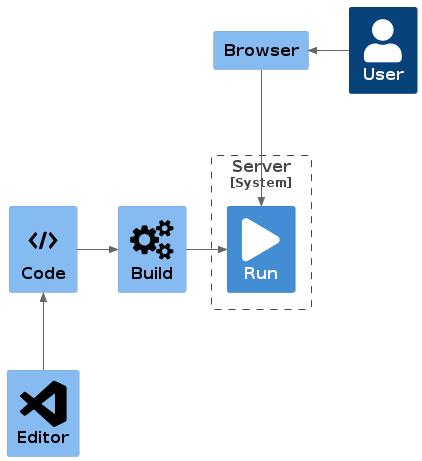
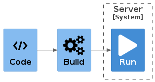
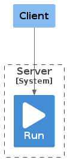
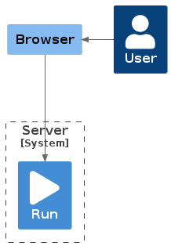
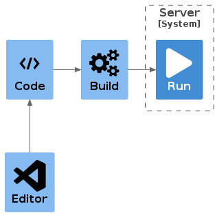
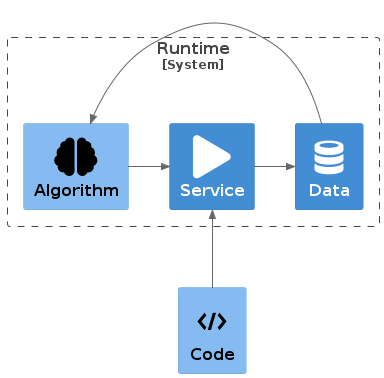
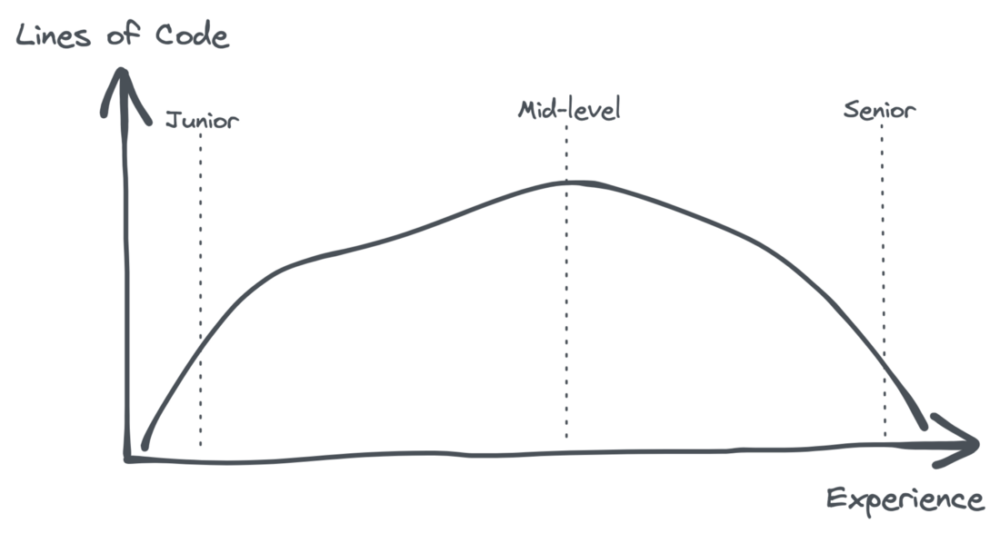

# Knowledge

This page contains a rich collection of knowledge.
Of course this is freely available online ... but maybe too much so!
Therefor here are short descriptions and selected links to other resources to prevent you from drowing in the online see of information.

- Start with the [Basics](#basics)
- Continue with the [Programming Language Characteristics](#programming-language-characteristics)

## Basics

You'll need some understanding of some concepts. Here are a few with a very limited explaination of them.



### It depends

'It depends' is the main response to many questions an IT guy will reply. Why? Just ... because it depends.
Software and technology are layers of technical capabilities and complexity is within each layer and multiplied between layers.
So the answer to a simple question is very often 'it depends.
It depends on which layer of the technology something arises.
It depends if it is on the client side or server side (see [client-server](#client-server)).
It depends on the error.
It depends on which specific technology or programming language is used.
It can depend on so many things!
Be prepared to get the answer: 'It depends'!

### code-build-run



Software is written as plain text files.
This can not be interpreted by computers directly ... most of the times (see [it depends](#it-depends)).
It is a common pattern that source code has to be transformed (compiled) to for computers executable software.
This transformation contains transforming the text files to machine readible files but also contains steps for bundling, collecting, downloading dependencies and many, many other steps.
In general all these steps combined are called 'build' or 'the build'.

This has to happen before the software can actually be executed on a computer. This execution is generally called 'run'.

### client-server



The internet connects computers.
Each computer can a client.
As a client this computer is requesting some resource through the internet from another computer.
The latter is set up as the server.
A server is just a piece of software that listens to a certain port of the computer the software is running on and that will respond to requests on that port.
So my local laptop or desktop computer can be turned into a server by starting a piece of software that listens to port 1000 for example.
You can use a browser as a client by navigating to http://127.0.01:1000.
The first part is the IP address (internet address) of my local computer (also called machine) and after the colon is the port you specify the request to, in this case port 1000.
DNS is the solution to hide the IP address numbers and use proper and names easy to remember.
Your local machine acts as a local host so this request can be written as http://localhost:1000.

### browser-server



A browser is a special client which also has rich features to run code and visualise downloaded resources.
In general browsers will request HTML resources from servers and this is the basic content of a webpage.
HTML is the structured content which includes the text, links to the images and links to formatting configuration like collors and such and also links to JavaScript.
These last sort are text files which are directly executable by the browser to animate the visualisation and do whole a lot of stuff which will make the user interface interactive for the user.

### code-editor



Source code are just text files.
You will need an editor to manipulate these text files preferably with support to check that instructions are valid for interpretation of the computer.
As long as the text files are valid the editor does not matter; you're free to choose your own.
A fully integrated editor which includes support for build tools and all kind of error handling during development is called a 'Integrated Development Environment' or IDE in short.
[Visual Studio Code](#vscode) is sort of a combination of a fairly simple editor and a full IDE.

### code-service-data-algorithm



Source code is always the base for a product, a service.
The service is used by clients and users and uses and produces data.
So the service has a connection to the database.
The data is than being used to train an algorithm.
Which in turn is used inside or by the running service.

For example security is mainly focused around the service and runtime environment of the service.
The code is NOT the valid focus for securing this environment.
Of course code can open up for vulnerabilities ... but it is not the main solution for security!

All parts can be open ... although the runtime will probably the least open.
When all (other) parts are open, they complement eachother in being open and transparant.
It is also possible to open up select parts.
**Open Data** is common for governments.
By applying **Open Source** as well the Open Data is even more trustworthy.
Opening up the algorithms is increasing trust in the system as a whole as well.
It is also possible to open up the algorithms on closed data.
Open Source with closed data is possible as well.
But again, opening up all parts will bring the highest level of trust of the system.

### junior-senior

While you write and read code you'll mature slowly.
The amount of code you will write will evolve with your matury.



See [Expose junior developers to senior code](https://levelup.gitconnected.com/if-you-want-senior-developers-then-expose-juniors-to-senior-code-446d04e28def)

## Programming Language Characteristics

There are differences between programming languages ... and those might influence the language of choice for a certain job.
Characteristics of languages can not be chosen by the developer; they just are the characteristics of a language as it is.
The job at hand will limit the options you'll have to choose a language and the characteristics will help you to make the final decision.
Whether you'll have the option for selecting a programming language or not, it is good to know the differences in characteristics between languages.
You have to take them into account while using each language!

### Compiled vs Interpreted

There's a great [video](https://youtu.be/I1f45REi3k4) explaining this subject by Coding Mentors.

An example of a 'compiled' (or actually an 'intermediate') language is Java.
Therefor it is not runnable straight away.
See `src/code/HelloWorld.java`.
You'll have to `compile` it first by running the Java Compiler:

```bash
cd src/code
javac HelloWorld.java
```

This will produce a `.class` file containing Java bytecode which in turn can be executed by your computer.
Well... Java is some what more complex; you'll need a Java Virtual Machine to actually run it.

> When we compile our Java program (e.g., using the javac command), we'll end up with our source code compiled into the binary representation of our code – a JVM bytecode.
> This bytecode is simpler and more compact than our source code, but conventional processors in our computers cannot execute it.
>
> To be able to run a Java program, the JVM interprets the bytecode.
> Since interpreters are usually a lot slower than native code executing on a real processor, the JVM can run another compiler which will now compile our bytecode into the machine code that can be run by the processor.
> This so-called just-in-time compiler is much more sophisticated than the javac compiler, and it runs complex optimizations to generate high-quality machine code.

_For more info about the JIT Java Compiler, check [Baeldung.com](https://www.baeldung.com/graal-java-jit-compiler)_

For the C programming language the compilation step will produce an actual directly executable file: a `.exe`.
Looks familiar?
Now you know where that extension comes from :wink:

--

An interpreted language doesn't need this compilation step to execute the code.
The interpreter is directly interpreting the code and executing it.

An example of an interpreted language is JavaScript.
NodeJS is such an interpreter available at the command line.
Run the example `hello-world.js` with:

```bash
cd src/code
node hello-world.js
```

A webbrowser is a JavaScript interpreter as well!
You can also run the above JavaScript example with the example HTML file which references the same JavaScript file.
Just open [hello-world.html](src/code/hello-world.html) with your default browser and open the developer tools (F12) / console :smiley:

[GeeksForGeeks](https://www.geeksforgeeks.org/difference-between-compiled-and-interpreted-language/) have a great explanation about the differences and comparison of Interpreted versus Compiled programming languages.

| <td colspan=2> COMPILED    | <td colspan=2> INTERPRETED |
| -------------------------- | -------------------------- | --------------- | ------------------------- |
| Ready to **run**           | **not** cross-platform     | cross-platform  | interpreter required      |
| often **faster**           | inflexible                 | simpler to test | ofter **slower**          |
| source code is **private** | extra step                 | easier to debug | source code is **public** |

### Type Systems

Type Systems is about knowing what type a variable is.
There are several aspects to this: **Strong vs Weak Typing** and **Static vs Dynamic Typing**.

Here is a short [video](https://youtu.be/jlUZw8-6ljw) explaining it.

Some languages have a so called strong and statically typed system.
This means that during compilation all types of variables are checked and validated ... and optimized for the running executable.
The effect is that you as a developer are helped during writing of the code whether the code might be wrong or whether you are expecting different types than they actually are.

Some languages have a so called weak and dynamically typed system.
This means that the type of a variable is checked during runtime.
The weak part comes from languages which just try to do things with variables even when typing is not taken into account.
For many cases this might even work so what's the problem?

Which type system you prefer also depends on the kind of job you have at hand.
Languages do have a certain type system so you can't choose a system with each language.
You'll choose a language and then you'll have to cope with the type system that comes with it.

### OOP vs FP

OOP stands for Object Oriented Programming, often referred to as procedural or imperative programming or language.
With OOP your code is organized around objects.
Objects have fields or attributes.
Objects have methods.
Objects have behavior.
Objects have references to other objects.

FP stands for Functional Programming.
Your code is organized in functions.
Functions are applied to data structures.

### Concurrency

> // TODO

### Test Driven Development

> // TODO

