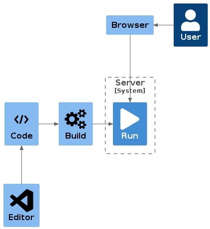

# Programming Guide

Help for my first programming experience. Start with [Work to do?](#work-to-do) and use the [Tools](#tools) section when you need a tool for a task.

## Work to do

1. Create your own [GitHub account](https://github.com/login)
1. Create a new repository: Go to your GitHub profile and select 'New'
   This will be your first program you'll write. Choose a fancy name like 'my-cool-progam'
1. Next step is 'cloning your repo' (repo is short for repository). This will download the online repository in GitHub to your local filesystem
   1. Open the GitHub Desktop
   1. Clone your 'my-cool-program' repo into an easy to find location on your system (e.g. C:\projects)
1. Open your files (in your repo) in VSCode by using the GitHub Desktop button

> // TODO JavaScript, HTML and CSS starters
> 
> [JavaScript introduction video](https://youtu.be/W6NZfCO5SIk)

## Knowledge

You'll need some understanding of some concepts. Here are a few with a very limited explaination of them.

### It depends

'It depends' is the main response to many questions an IT guy will reply. Why? Just ... because it depends.
Software and technology are layers of technical capabilities and complexity is within each layer and multiplied between layers.
So the answer to a simple question is very often 'it depends.
It depends on which layer of the technology something arises.
It depends if it is on the client side or server side (see [client-server](#client-server)).
It depends on the error.
It depends on which specific technology or programming language is used.
It can depend on so many things!
Be prepared to get the answer: 'It depends'!

### code-build-run

Software is written as plain text files.
This can not be interpreted by computers directly ... most of the times (see [it depends](#it-depends).
It is a common pattern that source code has to be transformed (compiled) to for computers executable software.
This transformation contains transforming the text files to machine readible files but also contains steps for bundling, collecting, downloading dependencies and many, many other steps.
In general all these steps combined are called 'build' or 'the build'.

This has to happen before the software can actually be executed on a computer. This execution is generally called 'run'.

### client-server

The internet connects computers.
Each computer can a client.
As a client this computer is requesting some resource through the internet from another computer.
The latter is set up as the server.
A server is just a piece of software that listens to a certain port of the computer the software is running on and that will respond to requests on that port.
So my local laptop or desktop computer can be turned into a server by starting a piece of software that listens to port 1000 for example.
You can use a browser as a client by navigating to http://127.0.01:1000.
The first part is the IP address (internet address) of my local computer (also called machine) and after the colon is the port you specify the request to, in this case port 1000.
DNS is the solution to hide the IP address numbers and use proper and names easy to remember.
Your local machine acts as a local host so this request can be written as http://localhost:1000.

### browser-server

A browser is a special client which also has rich features to run code and visualise downloaded resources.
In general browsers will request HTML resources from servers and this is the basic content of a webpage.
HTML is the structured content which includes the text, links to the images and links to formatting configuration like collors and such and also links to JavaScript.
These last sort are text files which are directly executable by the browser to animate the visualisation and do whole a lot of stuff which will make the user interface interactive for the user.

### code-editor

Source code are just text files.
You will need an editor to manipulate these text files preferably with support to check that instructions are valid for interpretation of the computer.
As long as the text files are valid the editor does not matter; you're free to choose your own.
A fully integrated editor which includes support for build tools and all kind of error handling during development is called a 'Integrated Development Environment' or IDE in short.
[Visual Studio Code](#vscode) is sort of a combination of a fairly simple editor and a full IDE.

## Tools

What do I need? (use Ctrl+click to open links)

### Git

Tool #1: [git](https://git-scm.com/) for version control of your local files; you'll need this a lot :wink:

This is a very basic tool ... and because we'll be using GitHub as well (see tool #2) we'll use the GitHub Desktop version of git.

- Download the [GitHub Desktop](https://desktop.github.com/)
- Install with all defaults
- Check out these instruction videos [part 1](https://youtu.be/9GKpbI1siow) and [part 2](https://youtu.be/n-p1RUmdl9M)

### GitHub

Tool #2: [GitHub.com](https://github.com/) for hosting your files online including the version history of all your files. By doing so you also have a backup of all your files _and_ you can share your changes with others. This is also used to publish your software releases.

### VSCode

Tool #3: [VSCode](https://code.visualstudio.com/) (or Visual Studio Code)

This is your editor to edit your files. You also will use this for your 'git actions' and synchronization with GitHub

### Markdown

Tool #4: [Markdown](https://docs.github.com/en/get-started/writing-on-github/getting-started-with-writing-and-formatting-on-github/basic-writing-and-formatting-syntax)

This is a format to create documentation like this guide. Files have `.md` extension (last part of the filename). In GitHub these Markdown files will be shown as webpages with links and formatting like bulletpoints and headers. Knowing this tool will help you document your own journey in developing your applications.

### NodeJS

Tool #5: [NodeJS](https://nodejs.org/en/)

## Contribution

This repo is edited with [VSCode](#vscode) and uses a [PlantUML plugin](https://marketplace.visualstudio.com/items?itemName=jebbs.plantuml) to generate the containing images. The sources can be found in `src/` and generation is (for now) executed manually on a local machine.
